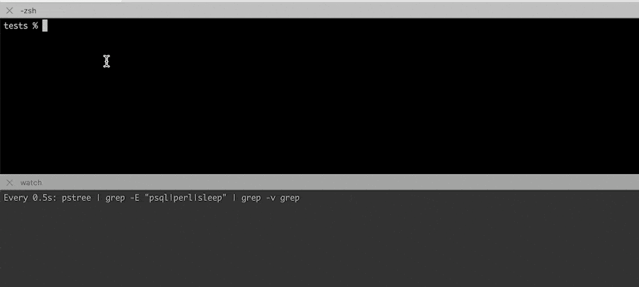
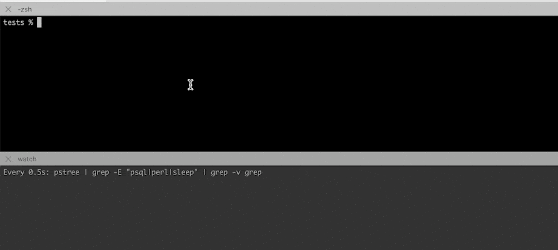
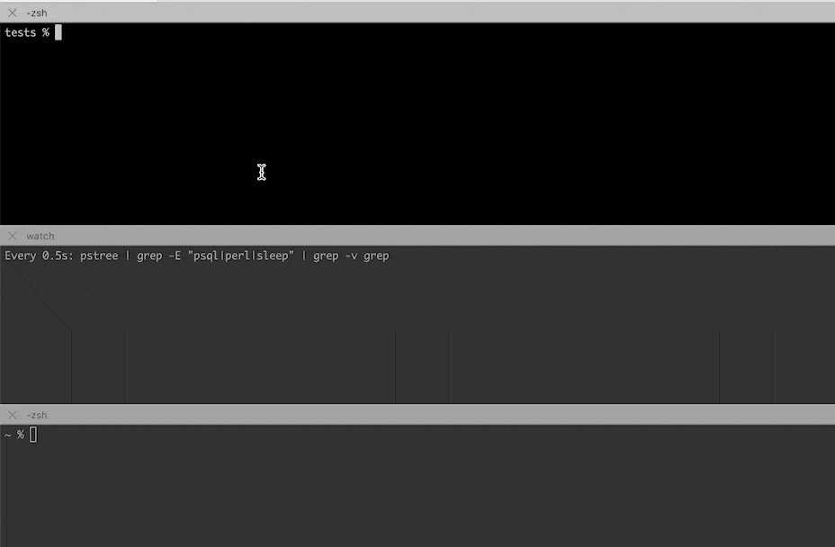

# run-in-separate-pgrp: launch a console command in a newly created foreground process group

This wrapper tool launches an arbitrary command (and all its future child
processes) in a newly created process group. The new process group also becomes
foreground (interactive in terminal) if you ran the tool in an interactive
session.


## Usage

```
run-in-separate-pgrp
  [--forward-signals-to-group | --forward-signals-to-child]
  [--print-signals]
  command [arg ...]
```


## Use Case 1: Limit Ctrl-C Impact

Use the tool if you want to limit the scope of Ctrl-C SIGINT propagation to only
the hierarchy of that new process group.

Motivation: terminals send SIGINT to ALL processes of a foreground process group
when Ctrl-C is pressed (not only to one process), which may kill some
intermediate parent processes like yarn. As an example, the tool can be used to
let interactive `psql` run in a `yarn` script (without the tool, `yarn` dies on
SIGINT, which effectively closes STDIN for `psql`).

With the tool, you can use Ctrl-C when running `yarn psql`:



Without the tool, pressing Ctrl-C kills yarn and thus kills psql on stdin EOF:



See details here:
- https://www.postgresql.org/message-id/flat/271520.1713052173%40sss.pgh.pa.us#6ebc31cdb0365b0de9e0a2e7e5cb2268
- https://www.cons.org/cracauer/sigint.html


## Use Case 2: Fanout Incoming Signals to All Processes in the New Group

If `--forward-signals-to-group` flag is passed, and the tool's process ID
receives some signal, this signal is forwarded to all children processes subtree
(in fact, to the processes of the new group). This is useful in e.g. GitHub
Actions which send a SIGINT to the currently running shell process ONLY. Shells
ignore that SIGINT, so the running jobs continue running until they are cruelly
killed by the action runner in ~10 seconds.



Alternatively, when `--forward-signals-to-child` is passed, the tool forwards
the signals to the command's process only (no fanout). This is less useful of
course.

See details here:
- https://github.com/ringerc/github-actions-signal-handling-demo


## Installation

You can download the tool file `run-in-separate-pgrp` and put it anywhere you
want (it's a stand-alone Perl script with no dependencies):

```
wget https://raw.githubusercontent.com/dimikot/run-in-separate-pgrp/main/run-in-separate-pgrp
chmod +x run-in-separate-pgrp
```

Alternatively, you can install it as a Node module to be available in your PATH:

```
npm install run-in-separate-pgrp
yarn add run-in-separate-pgrp
pnpm install run-in-separate-pgrp
```
